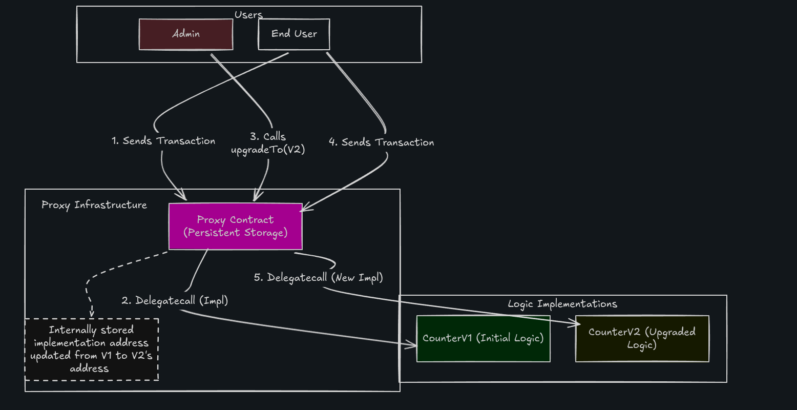

# Raw Upgradeable Proxy (Foundry)

This project demonstrates a **minimal upgradeable proxy architecture** using Solidity and Foundry.

It implements:

- A **Proxy contract** that stores state and forwards calls
- **CounterV1** – initial logic implementation
- **CounterV2** – upgraded logic implementation
- **Deploy scripts** to deploy and upgrade the proxy

The goal of this project is to understand **how `delegatecall` enables upgradeable contracts**.

---

# Architecture Overview

The proxy contract holds the **persistent storage** while the logic contracts contain **only executable code**.

Users always interact with the **proxy address**, and the proxy forwards execution to the current implementation using `delegatecall`.

After an upgrade, the proxy simply **points to a new implementation contract** without affecting storage.



---

# How It Works

### 1. User Interaction

Users interact with the **Proxy contract**, not the implementation contracts.


User → Proxy


---

### 2. Delegatecall to Implementation

The proxy forwards the call using `delegatecall`.


Proxy → delegatecall → CounterV1


Important properties of `delegatecall`:

- Code executes from **implementation**
- Storage is on the **proxy**
- `msg.sender` remains the **original caller**

---

### 3. Admin Upgrade

The admin upgrades the implementation by calling:

```code
proxy.upgradeTo(newImplementation)
```

This updates the stored implementation address inside the proxy.

---

### 4. After Upgrade

New calls are forwarded to the upgraded implementation.


Proxy → delegatecall → CounterV2


The **existing storage remains unchanged**, only the logic changes.

---

# Project Structure

```project
.
├── src
│ ├── Proxy.sol
│ ├── CounterV1.sol
│ └── CounterV2.sol
│
├── script
│ ├── DeployProxy.s.sol
│ └── UpgradeProxy.s.sol
│
├── test
│ └── DeployAndTest.t.sol
│
├── foundry.toml
└── README.md
```

---

# Install Dependencies

```code
forge install
```

---

# Build Contracts

```code
forge build
```

---

# Run Tests

```code
forge test -vv
```

---

# Start Local Blockchain

```code
anvil
```

---

# Deploy Proxy + CounterV1

```code
forge script script/DeployProxy.s.sol:DeployScript
--rpc-url http://127.0.0.1:8545

--private-key <PRIVATE_KEY>
--broadcast
```

This will deploy:

- `CounterV1`
- `Proxy` pointing to `CounterV1`

---

# Upgrade Proxy to CounterV2

Run the upgrade script and pass the **proxy address** from the CLI.

```code
forge script script/UpgradeProxy.s.sol:DeployScript
--sig "run(address)" <PROXY_ADDRESS>
--rpc-url http://127.0.0.1:8545

--private-key <PRIVATE_KEY>
--broadcast
```

This will:

1. Deploy `CounterV2`
2. Call `upgradeTo()` on the proxy
3. Update the implementation address

---

# Verify Upgrade

Check the implementation slot in the proxy storage.

```code
cast storage <PROXY_ADDRESS> 1 --rpc-url http://127.0.0.1:8545
```

---

# Important Takeaway

The proxy pattern works because:

- Proxy → holds storage
- Implementation → holds logic
- delegatecall → executes logic but data is stored on the proxy contract.

Upgrading simply changes **where the proxy handles execution**.
